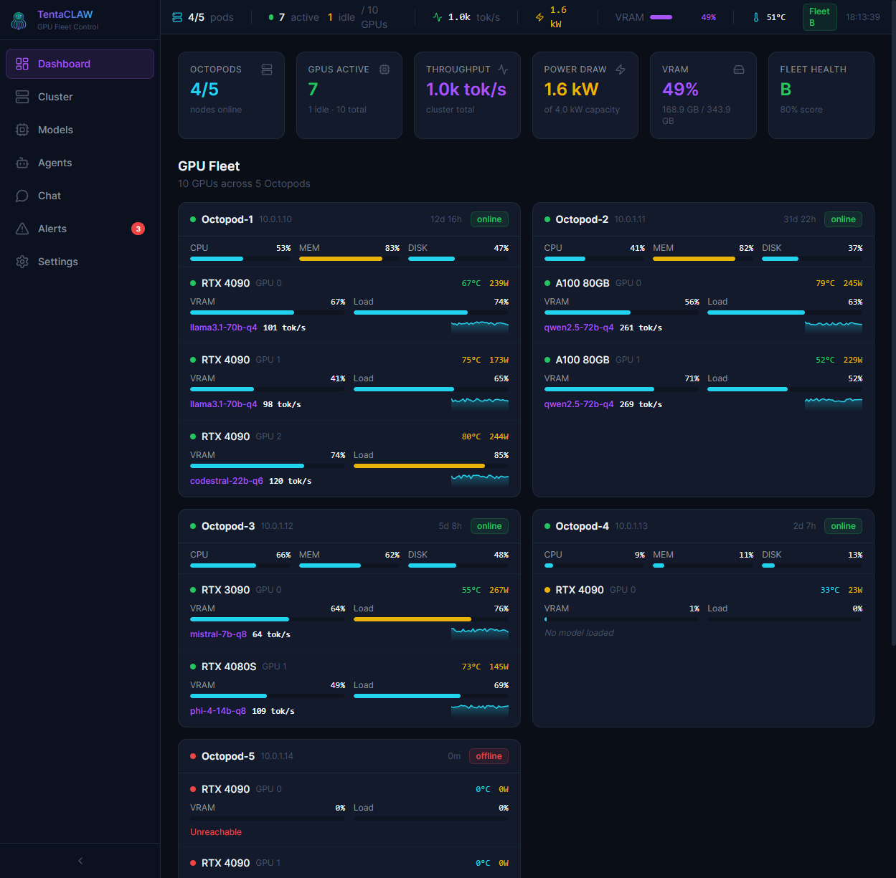
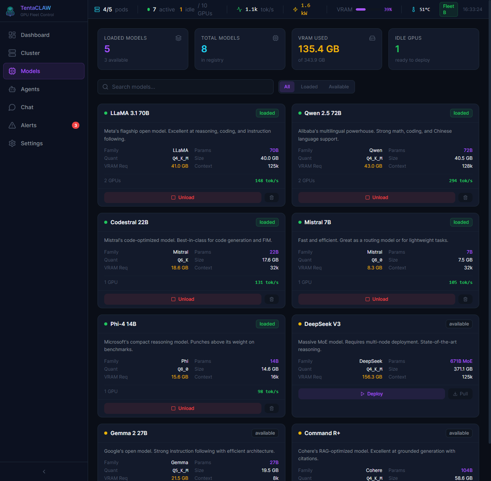
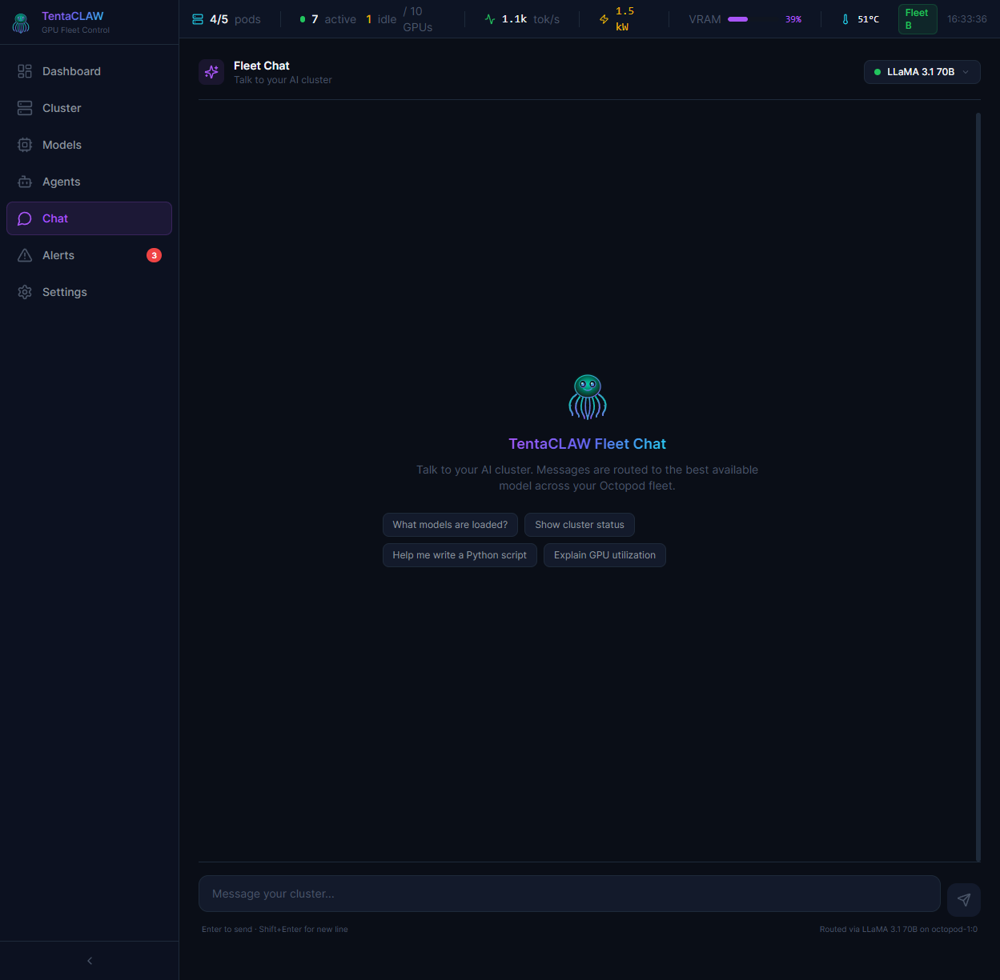
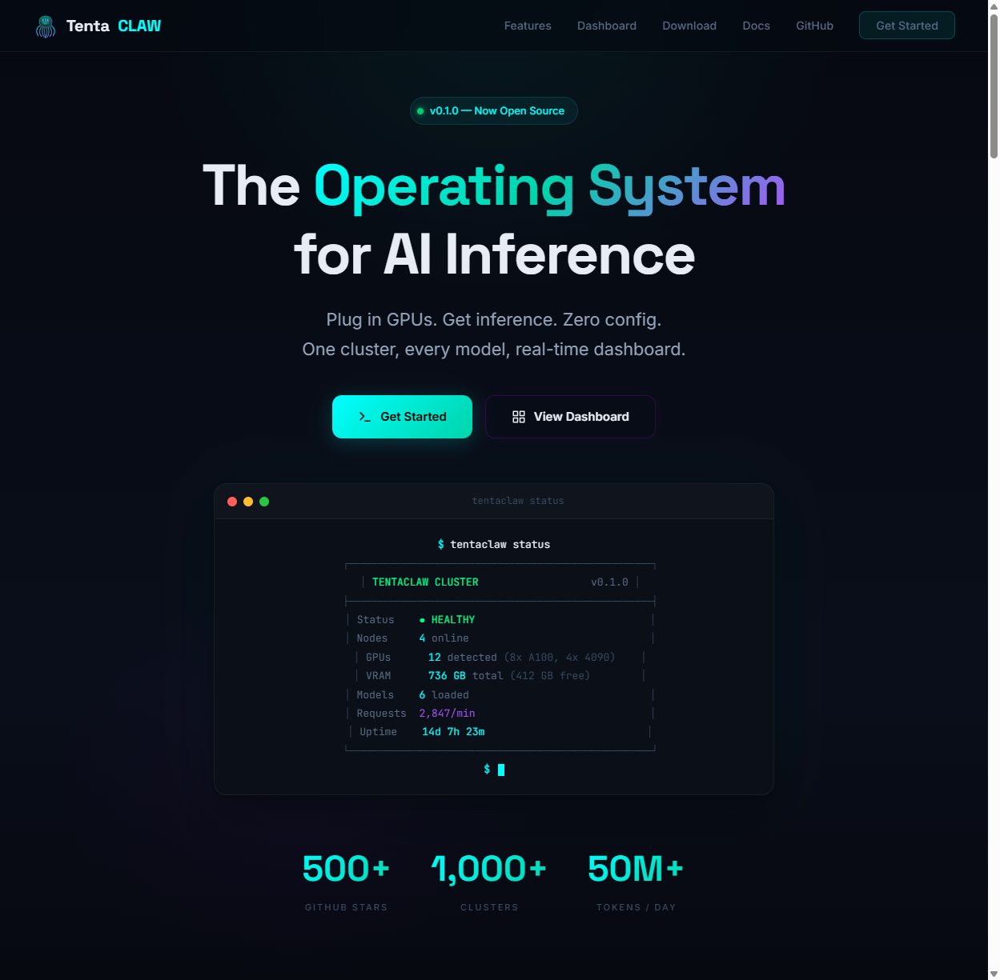

<p align="center">
  
</p>

<h1 align="center">TentaCLAW OS</h1>
<p align="center">
  <strong>The Operating System for AI Inference</strong><br>
  Plug in GPUs. Get inference. Zero config.
</p>

<p align="center">
  <a href="https://tentaclaw.io"></a>
  <a href="https://tentaclaw.io/docs.html"></a>
  <a href="https://github.com/TentaCLAW-OS/TentaCLAW/releases"></a>
  <a href="LICENSE"></a>
  <a href="https://discord.gg/tentaclaw"></a>
</p>

<p align="center"><em>"Eight arms. One mind. Zero compromises."</em></p>

---

## What is TentaCLAW?

TentaCLAW OS turns scattered GPUs into one self-healing AI inference cluster. It auto-detects hardware, routes requests to the best available model, and gives you a live dashboard + OpenAI-compatible API — all for the cost of your power bill.

- **Zero Config** — Auto-detect GPUs, auto-register nodes, auto-route inference
- **8 Inference Backends** — Ollama, vLLM, SGLang, llama.cpp, LM Studio, BitNet, TabbyAPI, TensorRT-LLM
- **OpenAI + Anthropic Compatible** — Drop-in replacement APIs: `/v1/chat/completions`, `/v1/messages`, `/v1/embeddings`, audio, images
- **Live Dashboard** — Real-time GPU monitoring with 7 pages: Fleet Overview, Cluster Control, Models, Agents, Chat, Alerts, Settings
- **28+ Integrations** — LangChain, n8n, Discord, Slack, VS Code, Grafana, Jupyter, HuggingFace, and more
- **AI Coding Agent** — Built-in CLI agent with 12 tools, persistent sessions, workspace memory
- **Model Marketplace** — Browse 135,000+ models from HuggingFace, pull from Ollama, publish to CLAWHub
- **Multi-Node Clustering** — Scale across distributed GPU machines with smart routing
- **Open Source** — MIT licensed, community-driven

## Screenshots

<p align="center">
  
  <br><em>Dashboard — Live fleet overview with real-time GPU stats from Octopod nodes</em>
</p>

<p align="center">
  
  <br><em>Cluster Control — Node tree, GPU details, and integrated shell</em>
</p>

<p align="center">
  
  <br><em>Models — Deploy, manage, and monitor LLMs across your fleet</em>
</p>

<p align="center">
  
  <br><em>Fleet Chat — Talk to AI models with the real TentaCLAW octopus</em>
</p>

<p align="center">
  
  <br><em>Agents — Build custom AI agents with tool integrations</em>
</p>

<p align="center">
  
  <br><em>Website — tentaclaw.io with download, docs, and gallery</em>
</p>

## Quick Install

### Gateway (Linux)

```bash
curl -fsSL tentaclaw.io/install | bash
```

### CLI Agent (Linux/macOS)

```bash
curl -fsSL tentaclaw.io/install-cli | bash
```

### CLI Agent (Windows)

```powershell
irm tentaclaw.io/install.ps1 | iex
```

### TentaCLAW OS (ISO)

Download the full Ubuntu 24.04-based distribution with TentaCLAW pre-installed:

**[Download ISO from Releases](https://github.com/TentaCLAW-OS/TentaCLAW/releases)**

Or build from source:
```bash
cd builder && sudo ./build-iso.sh
```

## Architecture

```
tentaclaw-os/
  gateway/      # API gateway + dashboard server (Hono, SQLite)
  agent/        # GPU node agent (heartbeat, stats, commands)
  cli/          # CLI + AI coding agent (zero dependencies)
  dashboard/    # React dashboard (Vite, Tailwind, Zustand)
  shared/       # Shared types, ASCII art, personality engine
  builder/      # ISO builder for TentaCLAW OS
  deploy/       # Cloud deployment configs (AWS, GCP, Azure)
  website/      # tentaclaw.io landing page + docs
  mcp/          # MCP server integration
  sdk/          # TentaCLAW SDK
```

## Running Locally

```bash
# Install dependencies
npm install

# Build gateway + dashboard
npm run build --workspace=gateway
npm run build --workspace=dashboard

# Start gateway (port 8080)
cd gateway && node dist/gateway/src/index.js

# Or with mock GPUs for development
cd gateway && npx tsx src/index.ts --mock --gpus 4
```

Dashboard: [http://localhost:8080/dashboard/](http://localhost:8080/dashboard/)

## API

TentaCLAW exposes an OpenAI-compatible API:

```bash
curl http://localhost:8080/v1/chat/completions \
  -H "Content-Type: application/json" \
  -H "Authorization: Bearer YOUR_API_KEY" \
  -d '{
    "model": "llama3.1-70b",
    "messages": [{"role": "user", "content": "Hello!"}]
  }'
```

TentaCLAW also supports the Anthropic Messages API (`POST /v1/messages`), audio transcription (Whisper), text-to-speech (Bark, Piper, XTTS), and image generation (SDXL, Flux).

See the [full API docs](https://tentaclaw.io/docs.html#gateway-api) for all endpoints.

## Supported Backends

| Backend | Auto-Detect | Key Features |
|---------|-------------|--------------|
| [Ollama](https://ollama.com) | Port 11434 | Native integration, context management, tool embedding |
| [vLLM](https://docs.vllm.ai) | `/v1/models` | PagedAttention, tensor parallelism, speculative decoding, FP8 |
| [SGLang](https://github.com/sgl-project/sglang) | `/v1/models` | RadixAttention (6.4x faster on RAG), prefix caching |
| [llama.cpp](https://github.com/ggerganov/llama.cpp) | Port 8080 | GGUF format, CPU+GPU, llamafile support |
| [LM Studio](https://lmstudio.ai) | Port 1234 | Desktop GUI, OpenAI-compatible |
| [BitNet](https://github.com/microsoft/BitNet) | — | 1-bit LLMs, per-GPU layer distribution |
| [TabbyAPI](https://github.com/theroyallab/tabbyAPI) | Token encode | ExLlamaV2 backend |
| [TensorRT-LLM](https://github.com/NVIDIA/TensorRT-LLM) | — | NVIDIA optimized, advanced parallelism |

## Integrations

TentaCLAW integrates with 28+ platforms:

**AI Frameworks:** LangChain, CrewAI, Dify, Jupyter
**Chat:** Discord, Slack, Telegram, Matrix
**Automation:** n8n, Make, Zapier
**Dev Tools:** VS Code, Continue.dev, Home Assistant
**Monitoring:** Grafana, Datadog, Sentry, PagerDuty, Uptime Kuma
**DevOps:** Jenkins, GitLab CI, Jira, Linear, Notion

See the [full integrations page](https://tentaclaw.io/integrations.html) for details.

## CLI

```bash
tentaclaw status          # Fleet health at a glance
tentaclaw nodes           # List all Octopod nodes
tentaclaw gpus            # GPU inventory with VRAM/temps
tentaclaw models          # Model registry
tentaclaw benchmark       # Run GPU benchmarks
tentaclaw code            # Launch AI coding agent
```

## Node Naming Convention

TentaCLAW nodes running on Proxmox are called **Octopods** (Octopod-1, Octopod-2, etc.) — because every arm of the octopus is a GPU.

## Environment Variables

| Variable | Default | Description |
|----------|---------|-------------|
| `TENTACLAW_PORT` | `8080` | Gateway listen port |
| `TENTACLAW_DB_PATH` | `./data/tentaclaw.db` | SQLite database path |
| `TENTACLAW_API_KEY` | — | Master API key |
| `TENTACLAW_NO_AUTH` | `false` | Disable all auth |
| `TENTACLAW_MOCK` | `false` | Fake GPU mode for dev |

See the [full configuration reference](https://tentaclaw.io/docs.html#configuration-reference) for all variables.

## Tests

```bash
npm test --workspace=gateway    # 1056 tests, ~19s
```

## Documentation

- **[Website](https://tentaclaw.io)** — Landing page
- **[Docs](https://tentaclaw.io/docs.html)** — Full documentation
- **[API Reference](https://tentaclaw.io/docs.html#gateway-api)** — All endpoints
- **[CLI Reference](https://tentaclaw.io/docs.html#cli-reference)** — All commands

## Contributing

Contributions welcome! See [CONTRIBUTING.md](CONTRIBUTING.md).

## License

MIT License. See [LICENSE](LICENSE).

---

<p align="center">
  <strong>TentaCLAW OS</strong> — Founded by Alexander Ivy<br>
  <a href="https://tentaclaw.io">tentaclaw.io</a> · <a href="https://github.com/TentaCLAW-OS/TentaCLAW">GitHub</a> · <a href="https://discord.gg/tentaclaw">Discord</a> · <a href="https://twitter.com/tentaclaw_os">Twitter</a>
</p>
