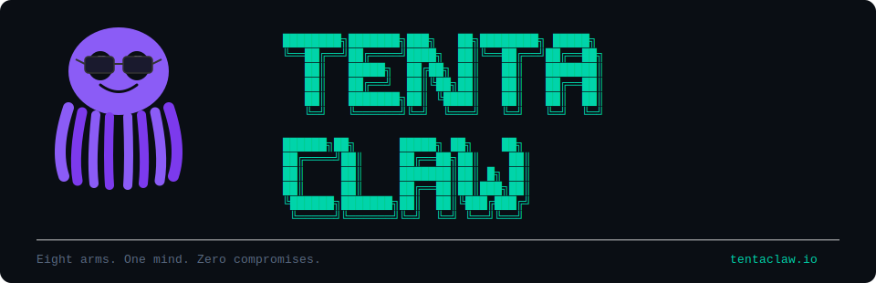
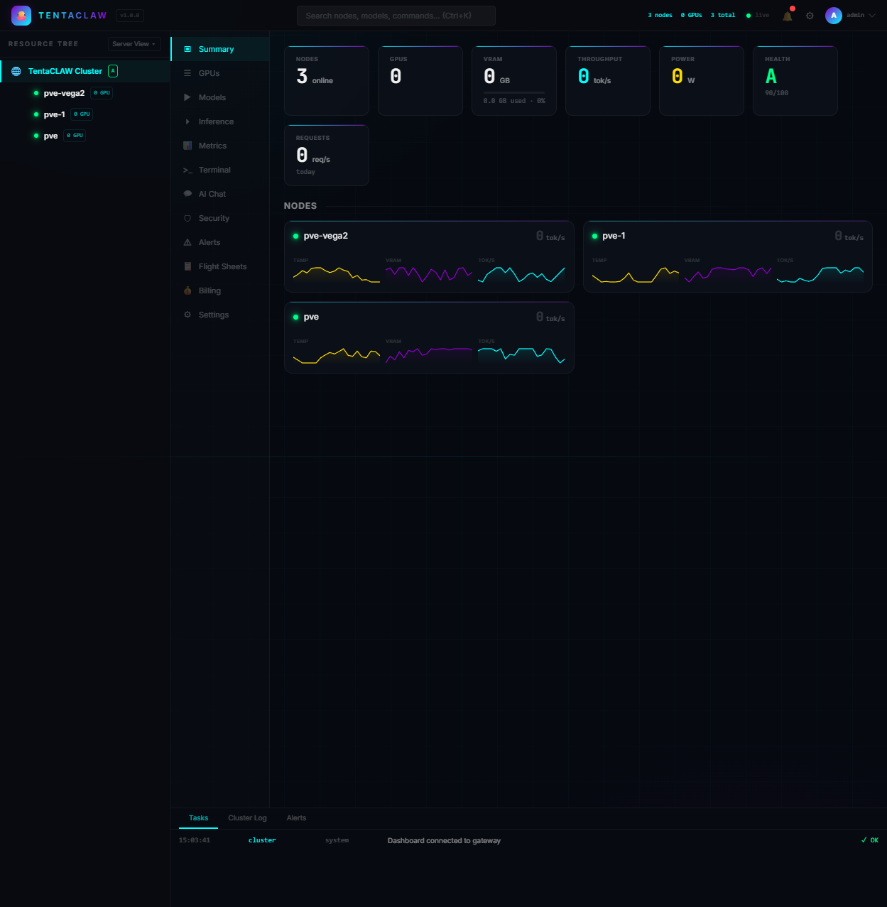
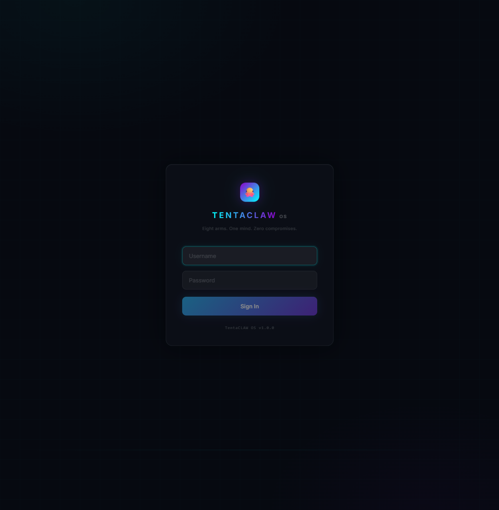
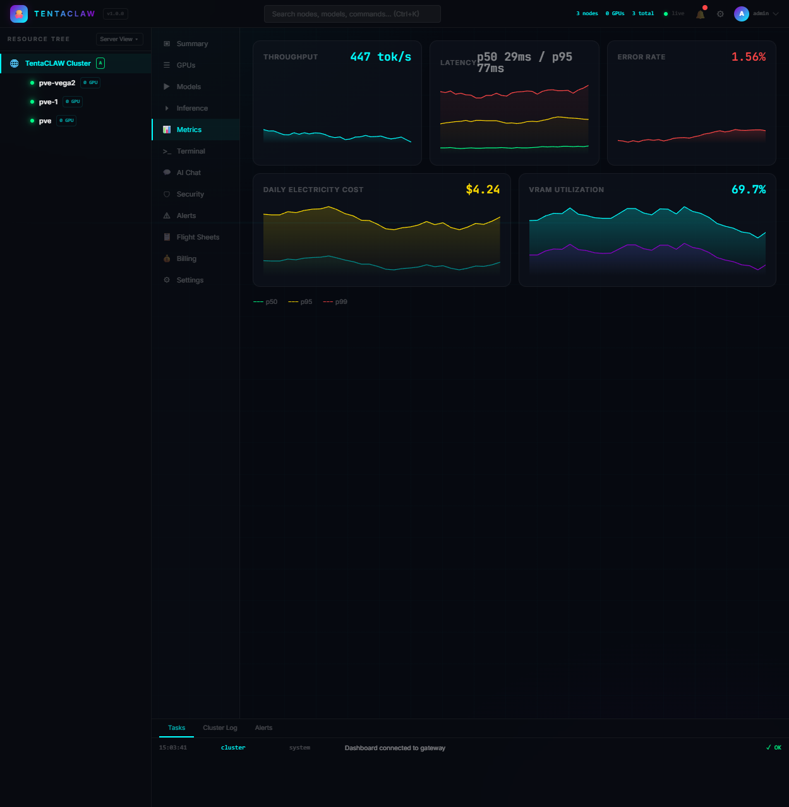
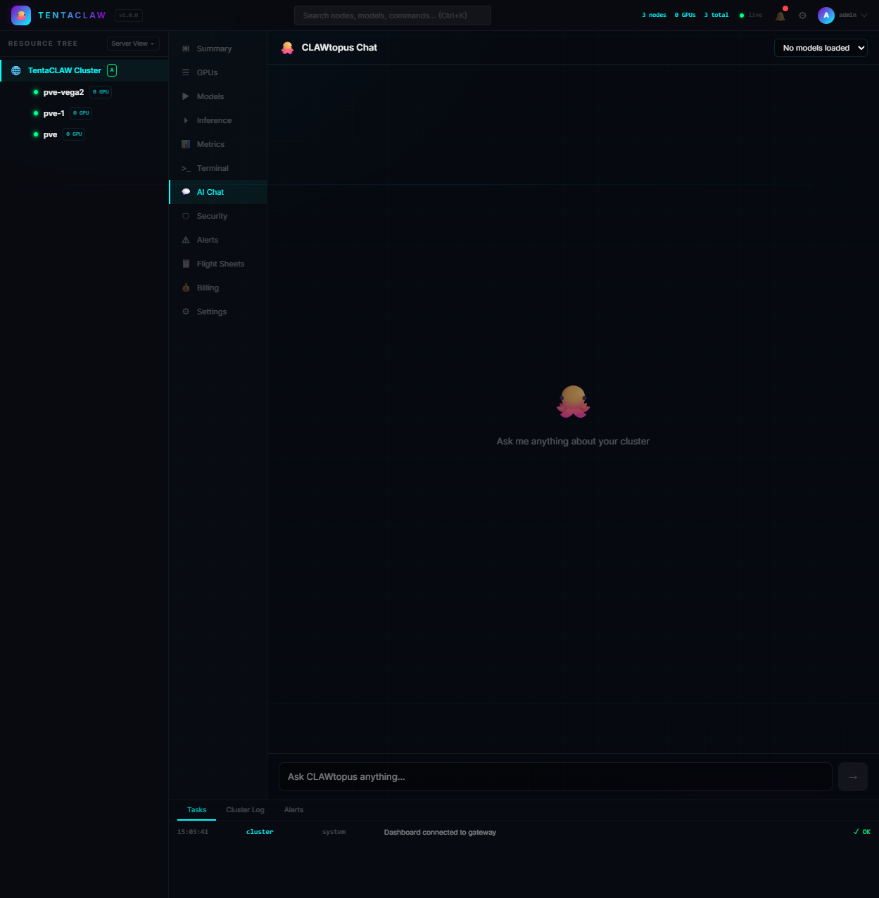
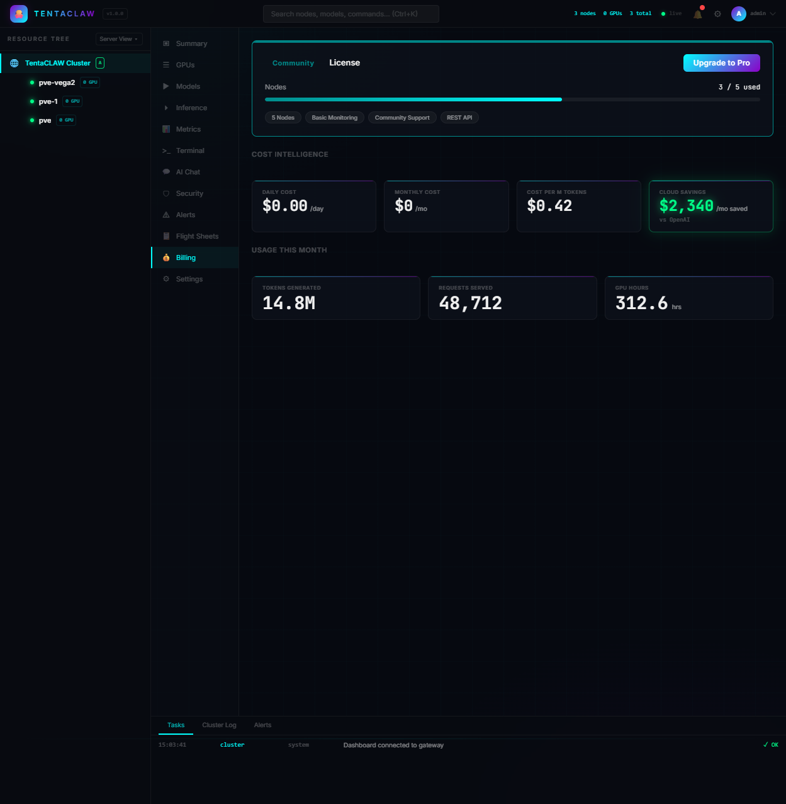
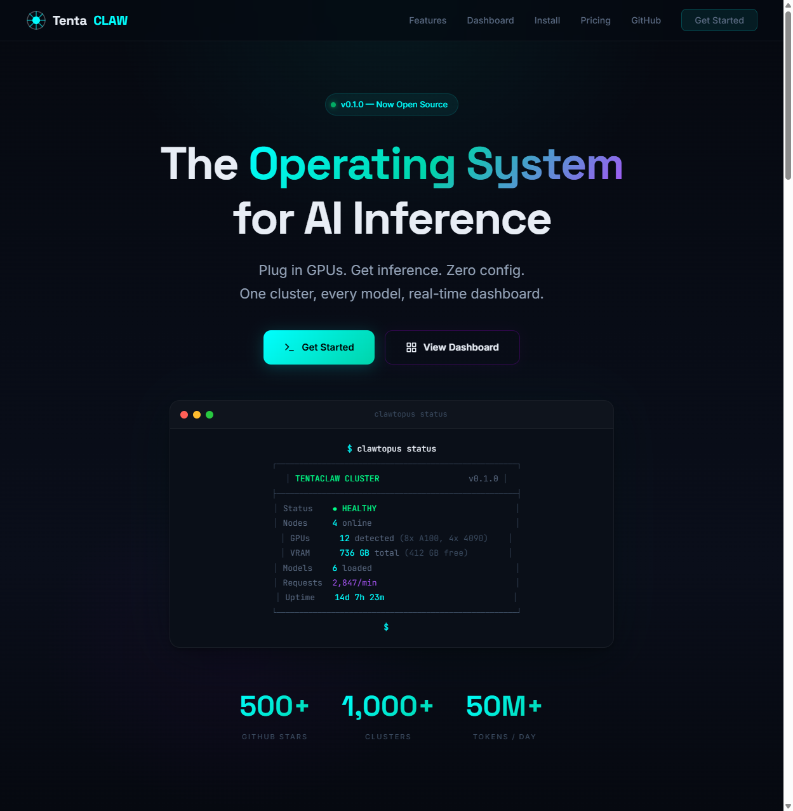
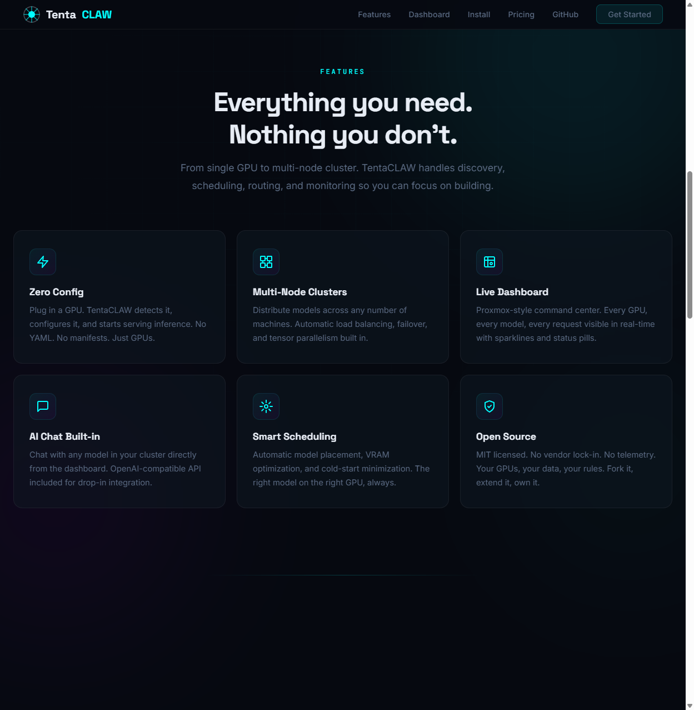
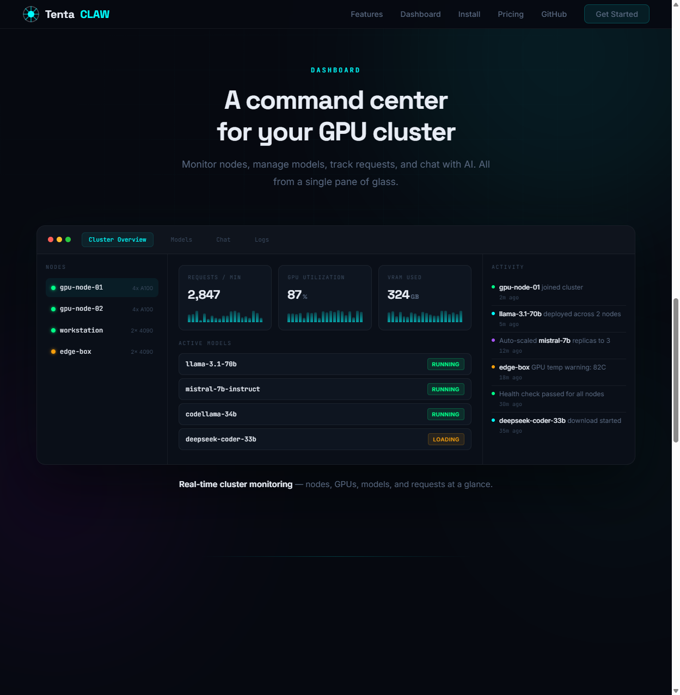
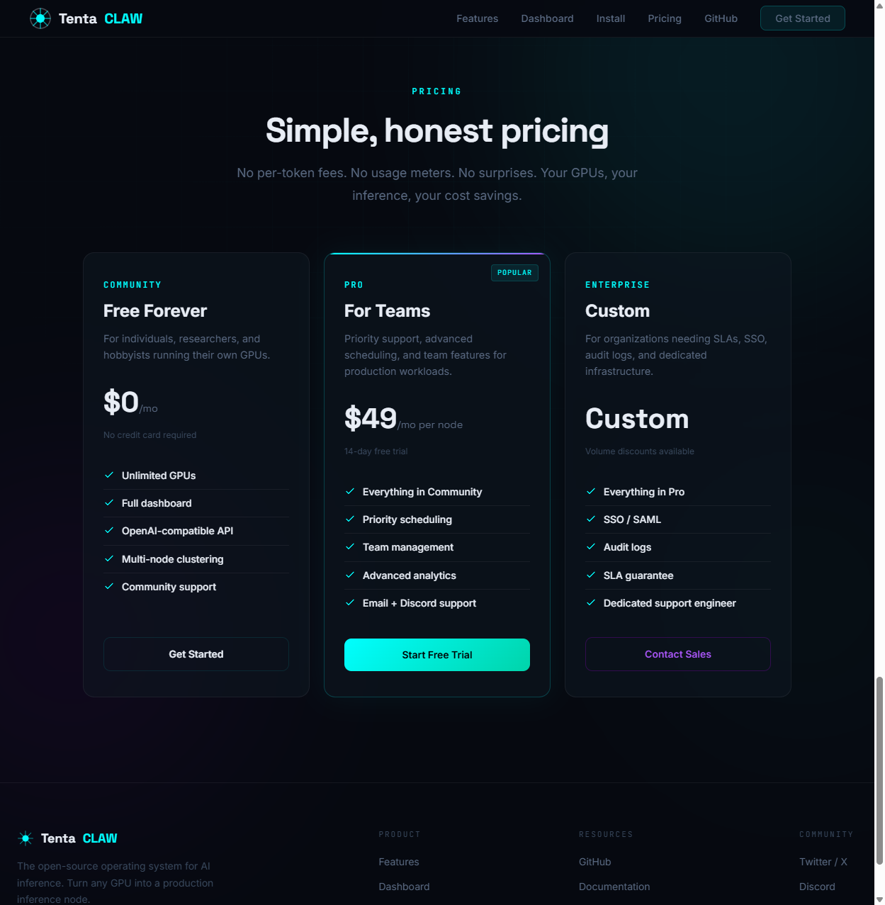

<p align="center">
  
</p>

<h3 align="center">Your GPUs. One Brain. Zero Limits.</h3>

<p align="center">
  <strong>TentaCLAW OS turns scattered GPUs into one self-healing AI inference cluster.<br>6 backends. Auto-discovery. Zero config.</strong>
</p>

<p align="center">
  <a href="https://github.com/TentaCLAW-OS/TentaCLAW/actions"></a>
  <a href="https://github.com/TentaCLAW-OS/TentaCLAW/actions"></a>
  <a href="LICENSE"></a>
  <a href="https://github.com/TentaCLAW-OS/TentaCLAW/stargazers"></a>
  <a href="https://discord.gg/tentaclaw"></a>
</p>

<p align="center">
  <a href="#install-in-60-seconds">Install</a> &bull;
  <a href="#quick-start">Quick Start</a> &bull;
  <a href="#features">Features</a> &bull;
  <a href="#why-tentaclaw">Comparison</a> &bull;
  <a href="https://www.tentaclaw.io">Website</a> &bull;
  <a href="docs/API.md">API Docs</a> &bull;
  <a href="docs/CLI.md">CLI Docs</a> &bull;
  <a href="https://discord.gg/tentaclaw">Discord</a>
</p>

---

## Install in 60 Seconds

```bash
curl -fsSL https://tentaclaw.io/install | bash
```

<details>
<summary><strong>Docker (one command)</strong></summary>

```bash
git clone https://github.com/TentaCLAW-OS/TentaCLAW.git && cd TentaCLAW
docker compose up
# Gateway → http://localhost:8080/dashboard
```

</details>

<details>
<summary><strong>From source</strong></summary>

```bash
git clone https://github.com/TentaCLAW-OS/TentaCLAW.git && cd TentaCLAW
cd gateway && npm install && npm run dev
# Open http://localhost:8080/dashboard
```

</details>

---

## Dashboard

<p align="center">
  
</p>

<p align="center"><em>Proxmox-style command center — 12 tabs, real-time SSE, resource tree, sparklines</em></p>

<details>
<summary><strong>More screenshots</strong></summary>

| Login | Metrics | AI Chat | Billing |
|-------|---------|---------|---------|
|  |  |  |  |

| Website Hero | Features | Dashboard Preview | Pricing |
|-------------|----------|-------------------|---------|
|  |  |  |  |

</details>

---

## Why TentaCLAW?

> "Per-token pricing is a scam." &mdash; CLAWtopus

There are GPU inference tools. There are model runners. There are cluster schedulers. None of them are a complete operating system for your AI hardware.

<table>
<thead>
<tr>
<th>Feature</th>
<th align="center">TentaCLAW OS</th>
<th align="center">GPUStack</th>
<th align="center">Ollama</th>
<th align="center">vLLM</th>
<th align="center">EXO</th>
</tr>
</thead>
<tbody>
<tr><td><strong>Multi-node cluster</strong></td><td align="center">Yes</td><td align="center">Yes</td><td align="center">No</td><td align="center">No</td><td align="center">Yes</td></tr>
<tr><td><strong>Auto-discovery (zero config)</strong></td><td align="center">UDP + mDNS</td><td align="center">No</td><td align="center">No</td><td align="center">No</td><td align="center">mDNS</td></tr>
<tr><td><strong>Bootable ISO</strong></td><td align="center">Yes</td><td align="center">No</td><td align="center">No</td><td align="center">No</td><td align="center">No</td></tr>
<tr><td><strong>Web dashboard</strong></td><td align="center">Built-in</td><td align="center">Built-in</td><td align="center">No</td><td align="center">No</td><td align="center">No</td></tr>
<tr><td><strong>CLI with 86 commands</strong></td><td align="center">Yes</td><td align="center">Basic</td><td align="center">Basic</td><td align="center">No</td><td align="center">No</td></tr>
<tr><td><strong>Multiple backends</strong></td><td align="center">6</td><td align="center">2</td><td align="center">1 (own)</td><td align="center">1 (own)</td><td align="center">1 (own)</td></tr>
<tr><td><strong>BitNet CPU inference</strong></td><td align="center">Yes</td><td align="center">No</td><td align="center">No</td><td align="center">No</td><td align="center">No</td></tr>
<tr><td><strong>Self-healing watchdog</strong></td><td align="center">Yes</td><td align="center">No</td><td align="center">No</td><td align="center">No</td><td align="center">No</td></tr>
<tr><td><strong>Flight sheets (declarative deploy)</strong></td><td align="center">Yes</td><td align="center">No</td><td align="center">No</td><td align="center">No</td><td align="center">No</td></tr>
<tr><td><strong>OpenAI-compatible API</strong></td><td align="center">Yes</td><td align="center">Yes</td><td align="center">Yes</td><td align="center">Yes</td><td align="center">Yes</td></tr>
<tr><td><strong>GPU overclocking</strong></td><td align="center">Yes</td><td align="center">No</td><td align="center">No</td><td align="center">No</td><td align="center">No</td></tr>
<tr><td><strong>Package marketplace</strong></td><td align="center">CLAWHub (185 pkgs)</td><td align="center">No</td><td align="center">No</td><td align="center">No</td><td align="center">No</td></tr>
<tr><td><strong>MCP server (AI agent access)</strong></td><td align="center">Yes</td><td align="center">No</td><td align="center">No</td><td align="center">No</td><td align="center">No</td></tr>
<tr><td><strong>Game engine bridge (UE5/Unity)</strong></td><td align="center">SSE stream</td><td align="center">No</td><td align="center">No</td><td align="center">No</td><td align="center">No</td></tr>
<tr><td><strong>NVIDIA + AMD + Intel + Apple Silicon + CPU</strong></td><td align="center">All</td><td align="center">NVIDIA + AMD</td><td align="center">All</td><td align="center">NVIDIA</td><td align="center">Apple + NVIDIA</td></tr>
<tr><td><strong>Helm / Terraform / Ansible</strong></td><td align="center">All three</td><td align="center">No</td><td align="center">No</td><td align="center">Helm</td><td align="center">No</td></tr>
<tr><td><strong>Prometheus + Grafana</strong></td><td align="center">Built-in</td><td align="center">No</td><td align="center">No</td><td align="center">Prometheus</td><td align="center">No</td></tr>
<tr><td><strong>Mascot with personality</strong></td><td align="center">Obviously</td><td align="center">No</td><td align="center">No</td><td align="center">No</td><td align="center">No</td></tr>
</tbody>
</table>

**TL;DR:** Ollama runs one model on one machine. vLLM serves one model really fast. EXO splits one model across devices. GPUStack manages a few nodes. TentaCLAW OS is the entire operating layer -- boot, discover, deploy, route, monitor, heal, scale -- across all your hardware.

---

## Features

**Cluster Management**
- :globe_with_meridians: **Zero-Config Auto-Discovery** -- Agents find the gateway via UDP broadcast + mDNS. Plug in a machine, it joins the cluster.
- :shield: **Self-Healing Watchdog** -- Crashed services restart automatically. Failed GPU resets. Node goes offline, models re-route. No babysitting.
- :zap: **Flight Sheets** -- Declarative model deployment. Define what runs where. Apply with one click or one command.
- :bar_chart: **Real-Time Dashboard** -- Web UI with live GPU temps, VRAM, tok/s, model status, alerts, and cluster health scoring.

**Inference**
- :brain: **6 Backend Support** -- Ollama, vLLM, SGLang, llama.cpp, BitNet, MLX. Pick the best backend per workload.
- :link: **OpenAI-Compatible API** -- Drop-in replacement. Point any client, framework, or agent at `http://your-cluster:8080/v1/`.
- :robot: **Smart Routing** -- Requests route to the best available node based on VRAM, model availability, queue depth, and health.
- :desktop_computer: **BitNet CPU Inference** -- 1-bit quantized models run on any CPU at 2-6x speed, 70% less energy. No GPU required.

**Operations**
- :octopus: **86-Command CLI** -- `clawtopus top`, `deploy`, `chat`, `drain`, `doctor`, `auto`, `gpu-map`, and 80 more. Full cluster control from your terminal.
- :package: **CLAWHub Marketplace** -- 185 packages: agents, skills, flight sheets, integrations, adapters, stacks, themes. Install with one command.
- :joystick: **Game Engine Bridge** -- SSE stream for Unreal Engine 5 / Unity. Visualize your cluster as a living neural network.
- :satellite: **Observability Stack** -- Prometheus metrics, Grafana dashboards, structured logging, alert channels (Discord, Slack, Telegram, webhooks).

---

## What's New in v0.3.0

- **CLAWHub Marketplace** -- 185 installable packages: agents, skills, flight sheets, integrations, themes, adapters, stacks
- **6 inference backends** -- Ollama, vLLM, SGLang, llama.cpp, BitNet, MLX with per-node backend management
- **86 CLI commands** -- `top`, `drain`, `cordon`, `doctor`, `auto`, `optimize`, `gpu-map`, `vibe`, `analytics`, and more
- **280+ API endpoints** -- Full REST API, OpenAI proxy, SSE events, game engine bridge, Prometheus metrics
- **MCP Server** -- AI agents can manage your cluster via Model Context Protocol tool calls
- **TypeScript SDK** -- Programmatic access to every gateway feature
- **Smart deploy** -- `clawtopus deploy llama3.1:8b` picks the best node automatically
- **Node drain / cordon / maintenance** -- Kubernetes-style operations for your GPU fleet
- **API key management** -- Scoped keys with rate limiting and usage tracking
- **Model aliases** -- Map `gpt-4` to `llama3.1:70b` for seamless client compatibility
- **Power monitoring** -- Per-node wattage, daily/monthly cost estimates
- **Fleet reliability metrics** -- Uptime stats, MTBF, availability grades per node
- **Notification channels** -- Discord, Slack, Telegram, email, webhook alerts
- **Inference analytics** -- Request counts, latency p50/p95/p99, model usage breakdown
- **Helm chart + Terraform + Ansible** -- Deploy anywhere, any way
- **Observability stack** -- Prometheus + Grafana with pre-built dashboards
- **810 tests passing** -- Gateway, agent, CLI, shared, integration, and e2e suites

---

## Quick Start

### Path 1: ISO (Production)

Flash. Boot. Done.

```bash
# Download the latest ISO
wget https://github.com/TentaCLAW-OS/TentaCLAW/releases/latest/download/tentaclaw-os-amd64.iso

# Flash to USB
sudo dd if=tentaclaw-os-amd64.iso of=/dev/sdX bs=4M status=progress

# Boot from USB — CLAWtopus handles the rest:
#   → Detects GPUs (NVIDIA, AMD, Intel)
#   → Connects to network (DHCP)
#   → Discovers gateway (UDP broadcast + mDNS)
#   → Registers with Farm Hash
#   → Starts serving inference
```

### Path 2: Dev Mode (Any Machine)

No GPUs needed. Mock agents simulate a real cluster.

```bash
git clone https://github.com/TentaCLAW-OS/TentaCLAW.git && cd TentaCLAW

# Terminal 1 — Gateway
cd gateway && npm install && npm run dev
# → Dashboard: http://localhost:8080/dashboard

# Terminal 2 — Mock agent (fake GPUs)
cd agent && npm install && npx tsx src/index.ts --mock

# Terminal 3 — Second node (optional)
cd agent && npx tsx src/index.ts --mock --name gpu-rig-02 --gpus 4

# Terminal 4 — CLI
cd cli && npm install && npm run build
npx clawtopus status
```

### Path 3: Docker

```bash
git clone https://github.com/TentaCLAW-OS/TentaCLAW.git && cd TentaCLAW
docker compose up
# Gateway + mock agent → http://localhost:8080/dashboard
```

### Path 4: Kubernetes (Helm)

```bash
helm repo add tentaclaw https://tentaclaw-os.github.io/charts
helm install tentaclaw tentaclaw/tentaclaw \
  --namespace tentaclaw --create-namespace \
  --set gateway.replicas=1 \
  --set agent.enabled=true
```

---

## Architecture

```
                          ┌──────────────────────┐
                          │     You / Client      │
                          │  curl, Python, JS,    │
                          │  LangChain, CrewAI    │
                          └──────────┬───────────┘
                                     │
                            OpenAI-compat API
                            POST /v1/chat/completions
                                     │
                                     ▼
┌──────────┐          ┌──────────────────────────────────────────┐
│CLAWtopus │          │        TentaCLAW Gateway (:8080)         │
│   CLI    │─────────▶│                                          │
│          │  86 cmds │  REST API (280+ endpoints)               │
│ clawtopus│          │  Web Dashboard      SSE Events           │
│ status   │          │  OpenAI Proxy       Game Engine Bridge   │
│ deploy   │          │  Prometheus /metrics                     │
│ chat     │          │  SQLite (11 tables)                      │
│ top      │          └──────────┬──────────┬──────────┬─────────┘
└──────────┘                     │          │          │
                      ┌──────────┘          │          └──────────┐
                      │       Push stats every 10s               │
                      │       Receive commands in response       │
                      ▼                     ▼                    ▼
              ┌──────────────┐   ┌───────────────┐   ┌───────────────┐
              │   Node 1     │   │    Node 2      │   │    Node 3     │
              │   Agent      │   │    Agent       │   │    Agent      │
              │              │   │                │   │               │
              │ RTX 4090 x2  │   │ RTX 3090       │   │ CPU only      │
              │ Ollama       │   │ vLLM           │   │ BitNet        │
              │ Farm:7K3P    │   │ Farm:7K3P      │   │ Farm:7K3P     │
              └──────────────┘   └────────────────┘   └───────────────┘
```

---

## Components

| Package | Path | Description |
|---------|------|-------------|
| **Gateway** | `gateway/` | Central coordinator -- 280+ REST endpoints, web dashboard, SSE, webhooks, OpenAI proxy, Prometheus metrics, SQLite. TypeScript + Hono. |
| **Agent** | `agent/` | Node daemon -- GPU detection (NVIDIA/AMD/Intel), system stats, auto-discovery (UDP+mDNS), watchdog, overclock, BitNet support. Zero deps. |
| **CLAWtopus CLI** | `cli/` | 86 commands -- chat, deploy, top, drain, doctor, auto, gpu-map, analytics, joke, fortune. Zero deps. |
| **MCP Server** | `mcp/` | Model Context Protocol server -- AI agents manage your cluster via tool calls. Zero deps. |
| **SDK** | `sdk/` | TypeScript SDK for programmatic gateway access. |
| **Shared** | `shared/` | Shared type definitions -- agent/gateway/CLI/MCP contract, personality engine, ASCII art. |
| **CLAWHub** | `clawhub/` | Package marketplace -- registry, schema validation, 185 packages across 8 categories. |
| **Builder** | `builder/` | ISO/PXE build system -- debootstrap Ubuntu 24.04, custom initrd, GRUB BIOS+UEFI. |
| **Observability** | `observability/` | Prometheus + Grafana stack with pre-built dashboards and alerting rules. |
| **Deploy** | `deploy/` | Helm chart, Terraform modules, Ansible playbooks, Kubernetes manifests, Docker production compose. |
| **Integrations** | `integrations/` | First-party integrations -- Dify, n8n, Home Assistant, Continue.dev, OpenClaw. |
| **Website** | `website/` | Project website source (tentaclaw.io). |

---

## Supported Hardware

| Vendor | GPU Status | Notes |
|--------|------------|-------|
| **NVIDIA** | Full support | Pascal and newer. CUDA detection via `nvidia-smi`. Overclocking supported. |
| **AMD** | Partial support | ROCm via `rocm-smi`. Detection implemented, backend integration in progress. |
| **Intel** | Planned | Arc GPUs. Detection stubbed, awaiting driver stabilization. |
| **Apple Silicon** | Via MLX backend | M1/M2/M3/M4. MLX backend handles Metal acceleration. |
| **CPU (BitNet)** | Full support | 1-bit quantized models on any x86_64 CPU. 2-6x faster, 70% less energy than FP16. |

---

## Supported Backends

| Backend | Type | Best For |
|---------|------|----------|
| **Ollama** | GPU / CPU | General purpose. Easy model management. Widest model support. |
| **vLLM** | GPU | High-throughput production serving. PagedAttention, continuous batching. |
| **SGLang** | GPU | Structured generation. JSON/regex constrained decoding. |
| **llama.cpp** | GPU / CPU | Lightweight inference. GGUF models. Low overhead. |
| **BitNet** | CPU only | 1-bit models. No GPU needed. Energy efficient. Great for CPU-only nodes. |
| **MLX** | Apple Silicon | Native Metal acceleration on Mac. M-series optimized. |

---

## CLAWHub Marketplace

> 185 packages. Install with one command.

CLAWHub is the package registry for TentaCLAW OS. Agents, flight sheets, integrations, skills, adapters, stacks, themes, and more -- all declarative YAML, all versioned.

| Category | Count | Examples |
|----------|-------|---------|
| **Agents** | 66 | `deep-researcher`, `code-reviewer`, `bug-hunter`, `blog-writer`, `threat-analyst`, `contract-reviewer`, `cluster-monitor`, `cost-optimizer` |
| **Skills** | 27 | `web-search`, `shell-exec`, `docker-manager`, `pdf-parser`, `sql-executor`, `slack-poster` |
| **Integrations** | 24 | Grafana, Discord, Home Assistant, n8n, Continue.dev, LangChain, CrewAI, Dify, Open WebUI, Telegram, Notion |
| **Flight Sheets** | 24 | `llama3-8b`, `deepseek-r1-70b`, `bitnet-cpu`, `qwen3.5-72b`, `whisper-stt`, `flux2-image`, `kokoro-tts`, `llama4-scout` |
| **Adapters** | 20 | `code-python`, `medical-terminology`, `creative-writing`, `formal-english`, `sql-expert` |
| **Themes** | 8 | `deep-ocean`, `terminal-green`, `cyberpunk`, `dracula`, `nord`, `catppuccin`, `tokyo-night`, `rose-pine` |
| **Stacks** | 8 | `rag-stack`, `code-assistant-stack`, `voice-ai-stack`, `enterprise-chat-stack`, `homelab-starter-stack` |
| **Examples** | 5 | Agent, skill, model, integration, theme templates |
| **Other** | 3 | Hardware profiles, deployment recipes |

```bash
clawtopus hub install deep-researcher
clawtopus hub install llama3-8b
clawtopus hub install cyberpunk
```

---

## Integrations

TentaCLAW OS plays well with the tools you already use.

| Integration | Description |
|-------------|-------------|
| **Dify** | Custom model provider. Use TentaCLAW as a backend for Dify workflows. |
| **n8n** | Native node for n8n workflow automation. Trigger deploys, query cluster status. |
| **Home Assistant** | Custom component. Monitor GPU temps, cluster health from your smart home dashboard. |
| **Continue.dev** | VS Code AI coding assistant backed by your local cluster. |
| **OpenClaw** | Multi-agent orchestration. Skills and scripts for TentaCLAW cluster management. |
| **LangChain** | Drop-in via OpenAI-compatible API. Point `ChatOpenAI` at your gateway. |
| **CrewAI** | Multi-agent crews powered by your local inference cluster. |
| **Grafana** | Pre-built dashboards for GPU metrics, inference latency, cluster health. |
| **Open WebUI** | Chat interface backed by your TentaCLAW cluster via OpenAI API. |

---

## API

280+ endpoints. Full OpenAI compatibility. Here are the essentials:

| Method | Endpoint | Description |
|--------|----------|-------------|
| `POST` | `/v1/chat/completions` | OpenAI-compatible chat (streaming supported) |
| `GET` | `/v1/models` | OpenAI-compatible model list |
| `GET` | `/health` | Gateway health check |
| `POST` | `/api/v1/register` | Register a node |
| `POST` | `/api/v1/nodes/:id/stats` | Push stats (returns pending commands) |
| `GET` | `/api/v1/nodes` | List all nodes with latest stats |
| `GET` | `/api/v1/summary` | Cluster summary (GPUs, VRAM, tok/s) |
| `GET` | `/api/v1/health/score` | Cluster health score (0-100, A-F grade) |
| `GET/POST` | `/api/v1/flight-sheets` | Manage flight sheets |
| `POST` | `/api/v1/flight-sheets/:id/apply` | Apply flight sheet to nodes |
| `GET` | `/api/v1/alerts` | Active alerts (temp, VRAM, disk) |
| `GET` | `/api/v1/events` | SSE stream for real-time updates |
| `GET` | `/api/v1/game/stream` | SSE stream for UE5/Unity integration |
| `GET` | `/metrics` | Prometheus metrics endpoint |

> Full API reference: **[docs/API.md](docs/API.md)**

---

## CLI

86 commands. Eight arms on the command line.

```bash
# Cluster overview
clawtopus status                          # Nodes, GPUs, VRAM, tok/s
clawtopus health                          # Health score (0-100) with letter grade
clawtopus top                             # Real-time monitor (refreshes every 3s)

# Deploy & manage models
clawtopus deploy llama3.1:8b              # Smart deploy — picks the best node
clawtopus models                          # List loaded models across cluster
clawtopus chat --model llama3.1:8b        # Interactive chat with your cluster

# Operations
clawtopus drain NODE-001                  # Maintenance mode — no new requests
clawtopus doctor                          # Diagnose + auto-fix cluster issues
clawtopus auto                            # Let CLAWtopus optimize everything

# Explore
clawtopus gpu-map                         # Visual GPU map of the cluster
clawtopus backends                        # List backends per node (Ollama, vLLM, BitNet...)
clawtopus analytics --hours 24            # Inference analytics and latency breakdown
```

> Full CLI reference: **[docs/CLI.md](docs/CLI.md)**

---

## CLAWtopus

The octopus that runs your cluster. Eight arms, each with a job.

```
            ___
           /   \
          | o o |
          | \___/ |     "I'm gonna make you an inference
           \_____/        you can't refuse."
       .-~|||||||~-.
      /  |||||||||| \         — CLAWtopus
     {  /|\ /|\ /|\  }
      \ |||_|||_||| /     Arm 1: Route      Arm 5: Benchmark
       '-.______.-'       Arm 2: Balance     Arm 6: Overclock
        |   |   |         Arm 3: Monitor     Arm 7: Heal
        |   |   |         Arm 4: Deploy      Arm 8: Scale
```

**CLAWtopus says:**
- *"Say hello to my little GPU."*
- *"Leave the gun. Take the model weights."*
- *"Per-token pricing is a scam."*
- *"Eight arms. One mind. Zero compromises."*
- *"I've got arms for days and VRAM for weeks."*
- *"You come to me, on this day of model deployment, asking for VRAM?"*

---

## Deploy Anywhere

| Method | Command |
|--------|---------|
| **ISO** | `dd if=tentaclaw-os.iso of=/dev/sdX bs=4M` |
| **Docker** | `docker compose up` |
| **Docker (Production)** | `docker compose -f deploy/docker/docker-compose.production.yml up` |
| **Kubernetes** | `kubectl apply -f deploy/kubernetes/` |
| **Helm** | `helm install tentaclaw deploy/helm/tentaclaw/` |
| **Terraform** | `cd deploy/terraform && terraform apply` |
| **Ansible** | `ansible-playbook -i inventory deploy/ansible/playbook.yml` |
| **Proxmox** | See [docs/PROXMOX.md](docs/PROXMOX.md) |

---

## Documentation

| Doc | Description |
|-----|-------------|
| **[Getting Started](docs/GETTING-STARTED.md)** | First-time setup guide |
| **[Quick Start](docs/QUICKSTART.md)** | 5-minute overview |
| **[API Reference](docs/API.md)** | Full REST API documentation |
| **[CLI Reference](docs/CLI.md)** | All 86 CLAWtopus commands |
| **[BitNet Guide](docs/BITNET.md)** | CPU-only inference with 1-bit models |
| **[AMD Support](docs/AMD.md)** | ROCm setup and GPU detection |
| **[Security](docs/SECURITY.md)** | API keys, SSH, hardening |
| **[Docker](docs/DOCKER.md)** | Container deployment guide |
| **[Proxmox](docs/PROXMOX.md)** | VM/LXC deployment on Proxmox VE |
| **[Networking](docs/NETWORKING.md)** | Auto-discovery, UDP broadcast, mDNS |
| **[Performance](docs/PERFORMANCE.md)** | Tuning and benchmarking |
| **[Themes](docs/THEMES.md)** | Dashboard theming and customization |
| **[Troubleshooting](docs/TROUBLESHOOTING.md)** | Common issues and fixes |
| **[FAQ](docs/FAQ.md)** | Frequently asked questions |
| **[Roadmap](docs/ROADMAP-v1.0.md)** | What's coming next |
| **[Build Spec](BUILD.md)** | ISO build system internals |
| **[Brand Guide](BRAND.md)** | Visual identity and design system |

---

## Project Stats

| Metric | Count |
|--------|-------|
| Tests passing | **810** |
| Lines of code | **68,000+** |
| Source modules | **57** |
| API endpoints | **280+** |
| CLI commands | **86** |
| CLAWHub packages | **185** |
| Inference backends | **6** |
| Deploy methods | **8** |

---

## Contributing

Contributions welcome. See **[CONTRIBUTING.md](CONTRIBUTING.md)** for guidelines.

Issues labeled **`clawtopus-wanted`** are good first contributions. We accept code, docs, CLAWHub packages, integrations, themes, and ASCII art.

```bash
# Run the full test suite
npm test

# Run gateway tests only
cd gateway && npm test

# Run with coverage
npm run test:coverage
```

---

## Community

| Channel | Link |
|---------|------|
| **Discord** | [The Tank](https://discord.gg/tentaclaw) -- CLAWtopus lives here |
| **GitHub Discussions** | [Questions, ideas, showcase](https://github.com/TentaCLAW-OS/TentaCLAW/discussions) |
| **GitHub Issues** | [Bugs and feature requests](https://github.com/TentaCLAW-OS/TentaCLAW/issues) |
| **Website** | [tentaclaw.io](https://www.tentaclaw.io) |

---

## License

MIT -- see [LICENSE](LICENSE) for details.

Use it. Fork it. Run it. Own your inference.

---

<p align="center">
  <strong>TentaCLAW OS</strong><br>
  <em>Eight arms. One mind. Zero compromises.</em><br><br>
  Built with eight arms by <a href="https://github.com/TentaCLAW-OS">TentaCLAW-OS</a><br><br>
  <sub>Per-token pricing is a scam.</sub>
</p>
