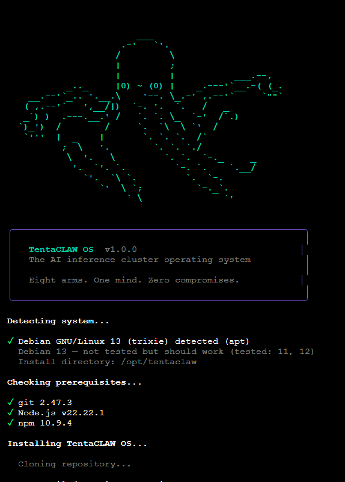

<p align="center">
  
</p>

<h3 align="center">Your GPUs. One Brain. Zero Limits.</h3>

<p align="center">
  <strong>TentaCLAW OS turns scattered GPUs into one self-healing AI inference cluster.<br>Multi-backend. Auto-discovery. Zero config. All for the cost of your power bill.</strong>
</p>

<p align="center">
  <a href="https://github.com/TentaCLAW-OS/TentaCLAW/actions"></a>
  <a href="https://github.com/TentaCLAW-OS/TentaCLAW/actions"></a>
  <a href="LICENSE"></a>
  <a href="https://github.com/TentaCLAW-OS/TentaCLAW/stargazers"></a>
  <a href="https://discord.gg/tentaclaw"></a>
</p>

<p align="center">
  <a href="#install">Install</a> &bull;
  <a href="#dashboard">Dashboard</a> &bull;
  <a href="#why-tentaclaw">Why TentaCLAW?</a> &bull;
  <a href="#architecture">Architecture</a> &bull;
  <a href="#api">API</a> &bull;
  <a href="#cli">CLI</a> &bull;
  <a href="https://tentaclaw.io">Website</a> &bull;
  <a href="https://tentaclaw.io/docs.html">Docs</a> &bull;
  <a href="https://discord.gg/tentaclaw">Discord</a>
</p>

---

<p align="center">
  
</p>

---

## Install

```bash
curl -fsSL https://tentaclaw.io/install | bash
```

That's it. The installer detects your OS, installs dependencies, builds the gateway and dashboard, and starts a systemd service. Open `http://your-ip:8080/dashboard`.

**Windows (PowerShell):** `irm tentaclaw.io/install.ps1 | iex`

**ISO Download:** [GitHub Releases](https://github.com/TentaCLAW-OS/TentaCLAW/releases) -- Ubuntu 24.04 with TentaCLAW pre-installed.

<details>
<summary><strong>Docker</strong></summary>

```bash
git clone https://github.com/TentaCLAW-OS/TentaCLAW.git && cd TentaCLAW
docker compose up
# Gateway + dashboard → http://localhost:8080/dashboard
```

Production mode with persistent data:

```bash
docker compose -f deploy/docker/docker-compose.production.yml up -d
```

</details>

<details>
<summary><strong>From source</strong></summary>

```bash
git clone https://github.com/TentaCLAW-OS/TentaCLAW.git && cd TentaCLAW
npm install
npm run build --workspace=gateway
npm run build --workspace=dashboard

# Start the gateway
cd gateway && node dist/gateway/src/index.js
# → http://localhost:8080/dashboard

# Start a mock agent (no GPU needed)
cd agent && npx tsx src/index.ts --mock
```

</details>

<details>
<summary><strong>Kubernetes (Helm)</strong></summary>

```bash
helm repo add tentaclaw https://tentaclaw-os.github.io/charts
helm install tentaclaw tentaclaw/tentaclaw \
  --namespace tentaclaw --create-namespace \
  --set gateway.replicas=1 \
  --set agent.enabled=true
```

</details>

---

## Dashboard

<p align="center">
  
</p>

<p align="center"><em>Live fleet dashboard -- 5 Octopods, 10 GPUs, real-time metrics</em></p>

<details>
<summary><strong>More screenshots</strong></summary>

| Cluster Overview | Models | Chat |
|-----------------|--------|------|
|  |  |  |

| Agents | Alerts | Settings |
|--------|--------|----------|
|  |  |  |

</details>

---

## Why TentaCLAW?

> *"Eight arms. One mind. Zero compromises."*

There are model runners. There are GPU servers. There are cluster schedulers. None of them are a complete operating system for your AI hardware.

<table>
<thead>
<tr>
<th>Feature</th>
<th align="center">TentaCLAW OS</th>
<th align="center">Ollama</th>
<th align="center">vLLM</th>
<th align="center">Kubernetes</th>
<th align="center">GPUStack</th>
<th align="center">EXO</th>
</tr>
</thead>
<tbody>
<tr><td><strong>Multi-node cluster</strong></td><td align="center">Yes</td><td align="center">No</td><td align="center">No</td><td align="center">Yes</td><td align="center">Yes</td><td align="center">Yes</td></tr>
<tr><td><strong>Auto-discovery (zero config)</strong></td><td align="center">UDP + mDNS</td><td align="center">No</td><td align="center">No</td><td align="center">No</td><td align="center">No</td><td align="center">mDNS</td></tr>
<tr><td><strong>Bootable ISO</strong></td><td align="center">Yes</td><td align="center">No</td><td align="center">No</td><td align="center">No</td><td align="center">No</td><td align="center">No</td></tr>
<tr><td><strong>Web dashboard</strong></td><td align="center">Built-in</td><td align="center">No</td><td align="center">No</td><td align="center">3rd-party</td><td align="center">Built-in</td><td align="center">No</td></tr>
<tr><td><strong>8 inference backends</strong></td><td align="center">Yes</td><td align="center">1 (own)</td><td align="center">1 (own)</td><td align="center">N/A</td><td align="center">2</td><td align="center">1 (own)</td></tr>
<tr><td><strong>BitNet CPU inference</strong></td><td align="center">Yes</td><td align="center">No</td><td align="center">No</td><td align="center">No</td><td align="center">No</td><td align="center">No</td></tr>
<tr><td><strong>Self-healing watchdog</strong></td><td align="center">4-level escalation</td><td align="center">No</td><td align="center">No</td><td align="center">Pod restart</td><td align="center">No</td><td align="center">No</td></tr>
<tr><td><strong>Flight sheets (declarative deploy)</strong></td><td align="center">Yes</td><td align="center">No</td><td align="center">No</td><td align="center">YAML manifests</td><td align="center">No</td><td align="center">No</td></tr>
<tr><td><strong>OpenAI-compatible API</strong></td><td align="center">Yes</td><td align="center">Yes</td><td align="center">Yes</td><td align="center">N/A</td><td align="center">Yes</td><td align="center">Yes</td></tr>
<tr><td><strong>AI coding agent (built-in)</strong></td><td align="center">Yes</td><td align="center">No</td><td align="center">No</td><td align="center">No</td><td align="center">No</td><td align="center">No</td></tr>
<tr><td><strong>MCP server</strong></td><td align="center">16 tools</td><td align="center">No</td><td align="center">No</td><td align="center">No</td><td align="center">No</td><td align="center">No</td></tr>
<tr><td><strong>Package marketplace</strong></td><td align="center">CLAWHub (96 pkgs)</td><td align="center">No</td><td align="center">No</td><td align="center">Helm charts</td><td align="center">No</td><td align="center">No</td></tr>
<tr><td><strong>NVIDIA + AMD + Apple + CPU</strong></td><td align="center">All four</td><td align="center">All</td><td align="center">NVIDIA</td><td align="center">NVIDIA</td><td align="center">NVIDIA + AMD</td><td align="center">Apple + NVIDIA</td></tr>
<tr><td><strong>Prometheus metrics</strong></td><td align="center">Built-in</td><td align="center">No</td><td align="center">Yes</td><td align="center">3rd-party</td><td align="center">No</td><td align="center">No</td></tr>
<tr><td><strong>Mascot with personality</strong></td><td align="center">Obviously</td><td align="center">No</td><td align="center">No</td><td align="center">No</td><td align="center">No</td><td align="center">No</td></tr>
</tbody>
</table>

**TL;DR:** Ollama runs one model on one machine. vLLM serves one model really fast. EXO splits one model across devices. Kubernetes orchestrates containers but knows nothing about GPUs. TentaCLAW OS is the entire operating layer -- boot, discover, deploy, route, monitor, heal, scale -- across all your hardware, all for the cost of your power bill.

---

## Architecture

```
                          ┌──────────────────────┐
                          │     You / Client      │
                          │  curl, Python, JS,    │
                          │  LangChain, CrewAI    │
                          └──────────┬───────────┘
                                     │
                            OpenAI-compat API
                            POST /v1/chat/completions
                                     │
                                     ▼
┌──────────┐          ┌──────────────────────────────────────────┐
│TentaCLAW │          │        TentaCLAW Gateway (:8080)         │
│   CLI    │─────────▶│                                          │
│          │          │  REST API (251+ endpoints)               │
│tentaclaw │          │  Web Dashboard      SSE Events           │
│ status   │          │  OpenAI Proxy       Prometheus /metrics  │
│ chat     │          │  8 Backends         SQLite (WAL mode)    │
│ code     │          │  MCP Server (16 tools)                   │
└──────────┘          └──────────┬──────────┬──────────┬─────────┘
                      ┌──────────┘          │          └──────────┐
                      │       Push stats every 10s               │
                      │       Receive commands in response       │
                      ▼                     ▼                    ▼
              ┌──────────────┐   ┌───────────────┐   ┌───────────────┐
              │  Octopod-1   │   │  Octopod-2    │   │  Octopod-3    │
              │  Agent       │   │  Agent        │   │  Agent        │
              │              │   │               │   │               │
              │ RTX 4090 x2  │   │ RX 7900 XTX  │   │ CPU only      │
              │ Ollama       │   │ vLLM          │   │ BitNet        │
              │ Farm:7K3P    │   │ Farm:7K3P     │   │ Farm:7K3P     │
              └──────────────┘   └───────────────┘   └───────────────┘
```

---

## Components

| Package | Path | Description |
|---------|------|-------------|
| **Gateway** | `gateway/` | Central brain -- 251+ REST endpoints, inference router, web dashboard, SSE events, webhooks, OpenAI/Anthropic proxy, Prometheus metrics, SQLite with WAL mode. TypeScript + Hono. |
| **Agent** | `agent/` | Node daemon -- GPU detection (NVIDIA/AMD/Apple Silicon), system stats, auto-discovery (UDP + mDNS + subnet scan), backend management, watchdog with 4-level escalation. |
| **CLI** | `cli/` | Cluster management + AI coding agent with 12 file/shell tools, 30+ slash commands, persistent sessions, and workspace memory. |
| **Dashboard** | `dashboard/` | React dashboard -- Vite, Tailwind, Zustand. 7 pages: Fleet, Cluster, Models, Agents, Chat, Alerts, Settings. 8 built-in themes. |
| **MCP Server** | `mcp/` | Model Context Protocol server -- 16 tools for Claude Desktop, Cursor, and any MCP-compatible client. |
| **SDK** | `sdk/` | TypeScript SDK for programmatic gateway access. |
| **Shared** | `shared/` | Shared type definitions -- agent/gateway/CLI/MCP contract, personality engine, ASCII art. |
| **CLAWHub** | `clawhub/` | Package marketplace -- registry, schema validation, 96 packages across 8 categories. |
| **Builder** | `builder/` | ISO/PXE build system -- Ubuntu 24.04 base, custom initrd, GRUB BIOS+UEFI. |
| **Deploy** | `deploy/` | Helm chart, Terraform modules, Ansible playbooks, Kubernetes manifests, Docker production compose. |
| **Integrations** | `integrations/` | First-party integrations -- Dify, n8n, Home Assistant, Continue.dev, LangChain, and more. |
| **Website** | `website/` | tentaclaw.io -- landing page, docs, install scripts, GitHub Pages. |

---

## Supported Hardware

| Vendor | Status | GPUs | Notes |
|--------|--------|------|-------|
| **NVIDIA** | Full support | GTX 10xx, RTX 20xx/30xx/40xx/50xx, Tesla, A100, H100 | CUDA detection via `nvidia-smi`. Overclocking supported. |
| **AMD** | Full support | RX 6000/7000, MI250/MI300, Vega, Polaris | Auto-selects Vulkan or ROCm per GPU architecture. |
| **Apple Silicon** | Via MLX backend | M1, M2, M3, M4 | Metal acceleration through MLX. Unified memory. |
| **Intel** | Planned | Arc A-series | Detection stubbed, awaiting driver stabilization. |
| **CPU (BitNet)** | Full support | Any x86_64 | 1-bit quantized models. No GPU needed. 2-6x faster than FP16. |

---

## Supported Backends

| Backend | Type | Status | Best For |
|---------|------|--------|----------|
| **Ollama** | GPU / CPU | Production | General purpose. Easy model management. Widest model support. |
| **vLLM** | GPU | Experimental | High-throughput production serving. PagedAttention, continuous batching. |
| **SGLang** | GPU | Experimental | Structured generation. JSON/regex constrained decoding. |
| **llama.cpp** | GPU / CPU | Experimental | Lightweight inference. GGUF models. Low overhead. |
| **BitNet** | CPU only | Experimental | 1-bit models. No GPU needed. 70% less energy than FP16. |
| **LM Studio** | GPU / CPU | Experimental | Desktop-friendly. GUI + API. |
| **TabbyAPI** | GPU | Experimental | ExLlamaV2 backend. Fast GPTQ/EXL2 inference. |
| **TensorRT-LLM** | NVIDIA GPU | Experimental | Maximum throughput on NVIDIA hardware. INT4/INT8/FP8. |

---

## CLAWHub Marketplace

> 96 packages. Install with one command.

CLAWHub is the package registry for TentaCLAW OS. Everything is declarative YAML, versioned, and installable from the CLI.

| Category | Count | Examples |
|----------|-------|---------|
| **Integrations** | 26 | Grafana, Discord, Slack, Home Assistant, n8n, Continue.dev, LangChain, CrewAI, Dify |
| **Adapters** | 20 | `code-python`, `medical-terminology`, `creative-writing`, `sql-expert`, `formal-english` |
| **Agents** | 17 | `deep-researcher`, `code-reviewer`, `bug-hunter`, `blog-writer`, `cluster-monitor` |
| **Themes** | 10 | `deep-ocean`, `terminal-green`, `cyberpunk`, `dracula`, `nord`, `catppuccin`, `tokyo-night` |
| **Stacks** | 9 | `rag-stack`, `code-assistant-stack`, `voice-ai-stack`, `enterprise-chat-stack` |
| **Skills** | 6 | `web-search`, `shell-exec`, `docker-manager`, `pdf-parser` |
| **Examples** | 5 | Agent, skill, model, integration, theme templates |
| **Flight Sheets** | 3 | `llama3-8b`, `deepseek-r1-70b`, `bitnet-cpu` |

```bash
tentaclaw hub install deep-researcher     # AI research agent
tentaclaw hub install llama3-8b           # Deploy Llama 3 to your cluster
tentaclaw hub install cyberpunk           # Dashboard theme
tentaclaw hub search "langchain"          # Search the registry
```

---

## Integrations

TentaCLAW OS plays well with the tools you already use.

| Integration | Description |
|-------------|-------------|
| **Dify** | Custom model provider. Use TentaCLAW as a backend for Dify AI workflows. |
| **n8n** | Native node for n8n workflow automation. Trigger deploys, query cluster status. |
| **Home Assistant** | Custom component. Monitor GPU temps and cluster health from your smart home dashboard. |
| **Continue.dev** | VS Code AI coding assistant backed by your local cluster. |
| **LangChain** | Drop-in via OpenAI-compatible API. Point `ChatOpenAI` at your gateway. |
| **CrewAI** | Multi-agent crews powered by your local inference cluster. |
| **Grafana** | Pre-built dashboards for GPU metrics, inference latency, cluster health. |
| **Discord** | Bot integration. Chat with your cluster, get alerts, manage models from Discord. |
| **Slack** | Slash commands and alert channels. `/tentaclaw status` in any channel. |
| **Telegram** | Bot for inference and alerts. Chat with models from your phone. |
| **VS Code** | Extension for model management, inference, and cluster monitoring. |

---

## API

251+ endpoints. Full OpenAI + Anthropic compatibility. Here are the essentials:

| Method | Endpoint | Description |
|--------|----------|-------------|
| `POST` | `/v1/chat/completions` | OpenAI-compatible chat (streaming supported) |
| `POST` | `/v1/messages` | Anthropic-compatible messages API |
| `GET` | `/v1/models` | OpenAI-compatible model list |
| `GET` | `/health` | Gateway health check |
| `POST` | `/api/v1/register` | Register a node with the cluster |
| `POST` | `/api/v1/nodes/:id/stats` | Push node stats (returns pending commands) |
| `GET` | `/api/v1/nodes` | List all nodes with latest stats |
| `GET` | `/api/v1/nodes/hot` | Nodes with GPUs above thermal threshold |
| `GET` | `/api/v1/nodes/idle` | Nodes with no active inference |
| `GET` | `/api/v1/summary` | Cluster summary (GPUs, VRAM, tok/s) |
| `GET` | `/api/v1/health/score` | Cluster health score (0-100, A-F grade) |
| `GET/POST` | `/api/v1/flight-sheets` | Manage declarative model deployments |
| `GET` | `/api/v1/alerts` | Active alerts (temp, VRAM, disk) |
| `GET` | `/api/v1/events` | SSE stream for real-time updates |
| `GET` | `/metrics` | Prometheus metrics endpoint |

```bash
# One-shot inference
curl http://localhost:8080/v1/chat/completions \
  -H "Content-Type: application/json" \
  -d '{"model": "llama3.1:70b", "messages": [{"role": "user", "content": "Hello!"}]}'
```

The gateway routes to the best available node automatically. Responses follow the standard OpenAI shape with additional `_tentaclaw` routing metadata.

---

## CLI

```bash
# Install
curl -fsSL tentaclaw.io/install-cli | bash   # Linux / macOS
irm tentaclaw.io/install.ps1 | iex           # Windows PowerShell
```

```bash
# Cluster management
tentaclaw status                          # Fleet health, node count, GPU utilization
tentaclaw nodes                           # List all Octopod nodes with status
tentaclaw models                          # List models across the cluster
tentaclaw health                          # Health score with letter grade
tentaclaw alerts                          # View active alerts and rules
tentaclaw bench                           # Run GPU benchmarks across nodes
tentaclaw logs                            # Stream gateway or agent logs
tentaclaw ssh <node>                      # Open a shell on a remote Octopod

# Inference
tentaclaw chat "What is VRAM?"            # One-shot inference from the terminal
tentaclaw chat --model llama3.1:70b       # Interactive streaming chat
tentaclaw pull deepseek-r1:70b            # Pull a model from Ollama/HuggingFace

# AI coding agent
tentaclaw code                            # Interactive REPL with 12 tools
tentaclaw code --model alexa-coder:latest # Use a specific model
tentaclaw code --resume <sessionId>       # Resume a previous session
```

---

## The Octopus

Eight arms, each with a job. TentaCLAW keeps your cluster healthy so you don't have to.

```
            ___
           /   \
          | o o |
          | \___/ |     "I'm gonna make you an inference
           \_____/        you can't refuse."
       .-~|||||||~-.
      /  |||||||||| \         -- TentaCLAW
     {  /|\ /|\ /|\  }
      \ |||_|||_||| /     Arm 1: Route      Arm 5: Benchmark
       '-.______.-'       Arm 2: Balance     Arm 6: Overclock
        |   |   |         Arm 3: Monitor     Arm 7: Heal
        |   |   |         Arm 4: Deploy      Arm 8: Scale
```

**TentaCLAW says:**

- *"Say hello to my little GPU."*
- *"Leave the gun. Take the model weights."*
- *"Per-token pricing is a scam."*
- *"Eight arms. One mind. Zero compromises."*
- *"I've got arms for days and VRAM for weeks."*
- *"You come to me, on this day of model deployment, asking for VRAM?"*

Proxmox nodes are called **Octopods** -- Octopod-1, Octopod-2, and so on. Because every good cluster needs a naming convention with personality.

---

## Security

| Control | Default | Status |
|---------|---------|--------|
| **Authentication** | API keys (SHA-256 hashed in DB) | On |
| **Cluster secret** | 256-bit auto-generated, `0600` perms | On |
| **Rate limiting** | 60 rpm unauth / 600 rpm auth | On |
| **Input validation** | 10MB payload limit, XSS sanitization | On |
| **Secure headers** | nosniff, DENY, HSTS, Permissions-Policy | On |
| **Audit logging** | All security events with actor + IP | On |

---

## Deploy Anywhere

| Method | Command |
|--------|---------|
| **One-curl** | `curl -fsSL tentaclaw.io/install \| bash` |
| **Docker** | `docker compose up` |
| **Docker (Production)** | `docker compose -f deploy/docker/docker-compose.production.yml up` |
| **Kubernetes** | `kubectl apply -f deploy/kubernetes/` |
| **Helm** | `helm install tentaclaw deploy/helm/tentaclaw/` |
| **Terraform** | `cd deploy/terraform && terraform apply` |
| **Ansible** | `ansible-playbook -i inventory deploy/ansible/playbook.yml` |
| **ISO** | Boot from USB -- Ubuntu 24.04 with TentaCLAW pre-installed |

---

## Links

- [Website](https://tentaclaw.io) -- Landing page, pricing, and downloads
- [Documentation](https://tentaclaw.io/docs.html) -- Setup guides, API reference, configuration
- [Integrations](https://tentaclaw.io/integrations.html) -- 28+ supported tools and platforms
- [Discord](https://discord.gg/tentaclaw) -- Community support and discussion (The Tank)
- [GitHub Issues](https://github.com/TentaCLAW-OS/TentaCLAW/issues) -- Bug reports and feature requests

## License

MIT -- see [LICENSE](LICENSE) for details. Use it. Fork it. Run it. Own your inference.

---

<p align="center">
  <strong>TentaCLAW OS</strong><br>
  <em>Eight arms. One mind. Zero compromises.</em><br><br>
  Founded by <a href="https://github.com/spaceghost1307">Alexander Ivy</a> &middot; <a href="https://tentaclaw.io">tentaclaw.io</a><br><br>
  <sub>Per-token pricing is a scam.</sub>
</p>
